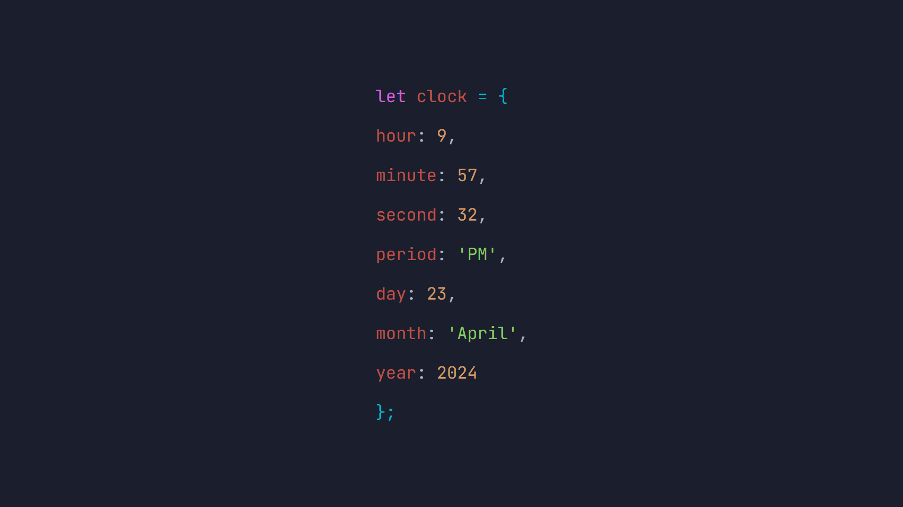

# JS Clock

---

This project is a simple web application that displays the current time in a digital clock format, as well as the date. It uses HTML, CSS, and JavaScript to present the information in a stylish manner. The colors are inspired in the Atom One Dark Theme

## Description

The application shows the current time in hours, minutes, and seconds, along with the period (AM/PM), the day, the month, and the year. The time updates in real-time every second.

## Project technologies

## Usage Instructions

1. Clone this repository to your local machine.
2. Open the `index.html` file in your preferred web browser.
3. The page will display the current time and date, updating every second.

## Developed By

This project was developed by Alejandro Lucena, aka aelodev.

## Credits

This project was developed using HTML, CSS, and JavaScript for educational and demonstration purposes.

## License

This project is licensed under the [GPL License](https://www.gnu.org/licenses/gpl-3.0.html). For more details, see the LICENSE file.
